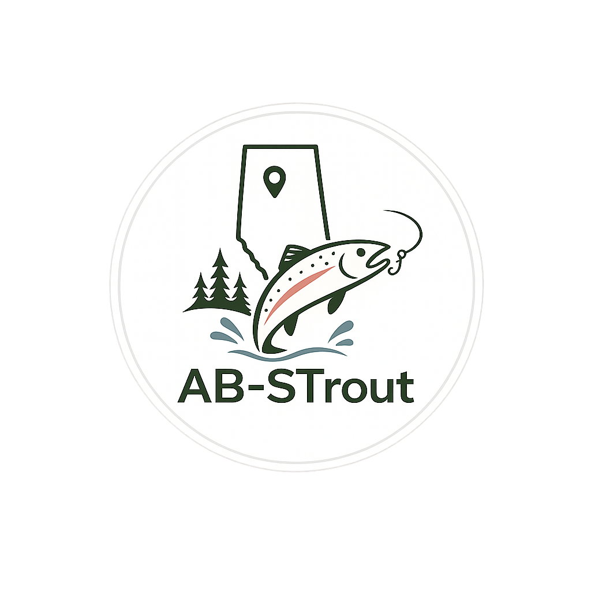

<p align="center">
  
</p>

# StockFishStat

An unofficial web app for quickly browsing Alberta stocked trout waters. Search and filter lakes, ponds, rivers, and reservoirs, view stocking stats on a map, and open full details for each water body.

**Live data source:** [Alberta Open Government — Fish Stocking List](https://open.alberta.ca/publications/fish-stocking-list)

> StockFishStat is not affiliated with the Government of Alberta. Always verify regulations, access, and stocking status with official resources before fishing. See **Disclaimer & Terms of Use** in the app footer for full details.

## Features

- **Home** — Browse all water bodies with filters, sorting, and pagination
- **Map** — Interactive map with markers, popups, and regional filters
- **Details** — Full fish statistics, difficulty rating, stocking logs, and Google Maps navigation
- **Filters** — Distance from Calgary/Edmonton, water body type, trout species, Alberta quadrant (NE/NW/SE/SW on map)
- **Sorting** — Name, population, difficulty, latest stocked, distance (ascending or descending)

## Tech stack

- [React 19](https://react.dev/) + [TypeScript](https://www.typescriptlang.org/)
- [Vite](https://vite.dev/)
- [React Router](https://reactrouter.com/)
- [Leaflet](https://leafletjs.com/) / [react-leaflet](https://react-leaflet.js.org/)

## Getting started

### Prerequisites

- [Node.js](https://nodejs.org/) 18+ recommended

### Install & run

```bash
npm install
npm run dev
```

Open the URL shown in the terminal (usually `http://localhost:5173`).

### Build for production

```bash
npm run build
npm run preview
```

## Data

Water body records live in `datas/fish-waters.json`. Use `datas/fish-water-template.json` as a reference when adding new entries.

Each record includes:

- Water body name, type, difficulty, population, and stocking dates
- Fish species breakdown (brook, brown, tiger, rainbow, cutthroat trout, walleye)
- Location (legal land description, coordinates, distance from Calgary/Edmonton)
- Stocking logs

### Maintenance scripts

```bash
# Preview location/distance enrichment (dry run)
npm run enrich-locations

# Write coordinates and city distances to fish-waters.json
npm run enrich-locations:write

# Preview water body type classification
npm run classify-water-types

# Write waterBodyType field to fish-waters.json
npm run classify-water-types:write
```

The enrichment script uses OpenStreetMap geocoding and Alberta legal land description parsing. Results are cached in `scripts/.geocode-cache.json`.

## Project structure

```
datas/                  JSON data files
scripts/                Data enrichment and classification scripts
src/
  components/           Shared UI (filters, cards, map popups, pagination)
  data/                 Data loader
  pages/                Home, Map, Details, Disclaimer
  types/                TypeScript types and constants
  utils/                Filtering, sorting, distance, and map helpers
```

## Developer

Created by **Hayden Davac**.

## License

This project is provided as-is for personal and educational use. Data originates from Alberta Open Government publications and may be subject to those terms. See the disclaimer page in the app for terms of use and liability limitations.
